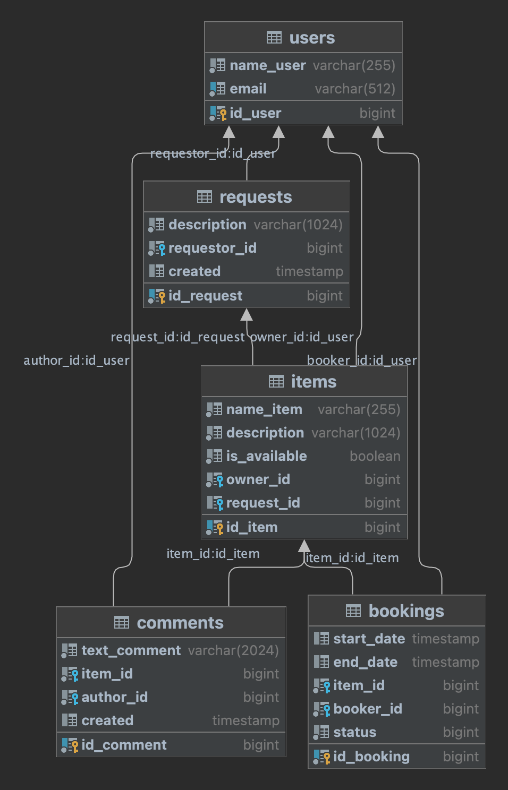

# Shareit
  ShareIt обеспечивает пользователям:
   - возможность рассказывать, какими вещами они готовы поделиться;
   - находить нужную вещь и брать её в аренду на какое-то время.

Сервис позволяет не только бронировать вещь на определённые даты, но и закрывать к ней доступ на время 
бронирования от других желающих.

После того как вещь возвращена, у пользователя, который её арендовал, есть возможность оставить отзыв.

На случай, если нужной вещи на сервисе нет, у пользователей есть возможность оставлять запросы. 

По запросу можно добавлять новые вещи для шеринга. 

*Веб сервис ShareIt имеет многомодульную структуру. Он написан на Java 11 с использованием Spring Boot. 
В разработке использованы Hibernate ORM, REST API, PostgreSQL, Docker.* 

## Схема баз данных:



## Запуск:
Запуск осуществляется с использованием Docker-контейнеров.

Склонируйте репозиторий: 
```git clone https://github.com/AnastasiaKuznetsova2806/java-shareit.git```

Зайдите в корневую папку проекта:
```cd java-shareit```

У вас должен быть установлен maven.

```mvn clean install```

Также нужно скомпилировать target для работы QModules (пример QEvent) 
сторонней библиотеки Querydsl. 
```mvn compile```

Для запуска используйте команду докера:
```docker-compose up -d``` 

Docker содержит в себе 3 контейнера
shareit-gateway port:8080:8080
shareit-server port:9090:9090
shareit-bd port:6541:5432
